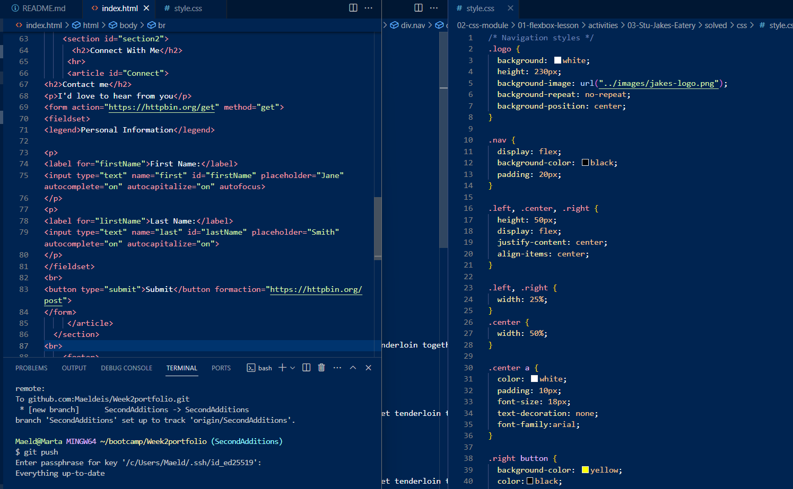
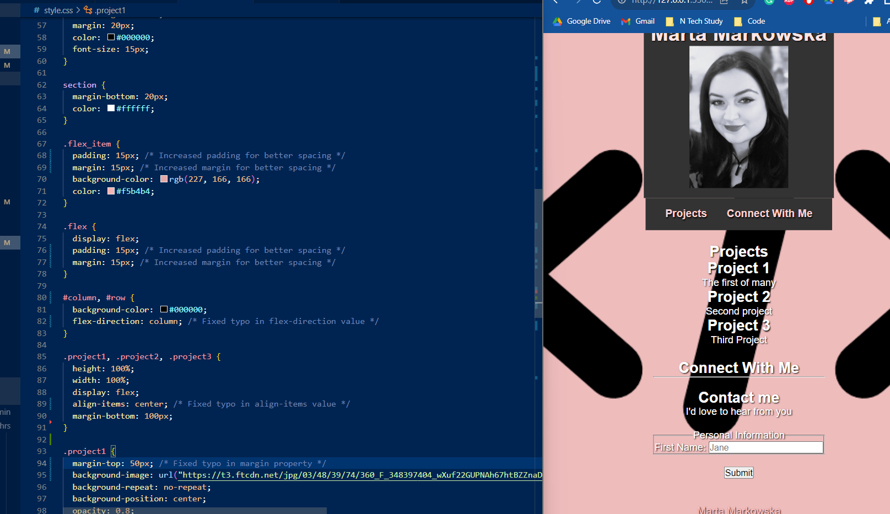
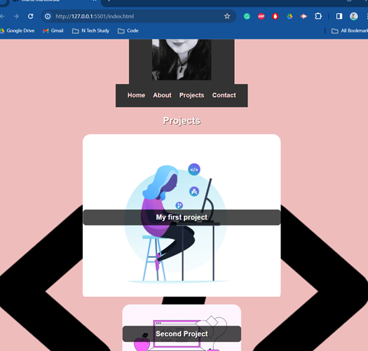

# Bootstrap-Portfolio
New version control, portfolio with bootstrap additions
# Week2portfolio
https://github.com/Maeldeis/Week2portfolio
 https://maeldeis.github.io/Week2portfolio/
A portfolio for the second challenge
Creating a user responsive portfolio of current and future work for potential clients/employers.

Changing the project images
Closing shadows on text for readability, adjusting padding

I've made some improvements for better organization, added accessibility attributes, and enhanced the styling. 

# Week 3 additions with bootstrap
This revised code incorporates the suggested improvements for color variables, font stacks, and consolidated container styles.

This is the new base I am starting from - added my first project with images for all future ones.

